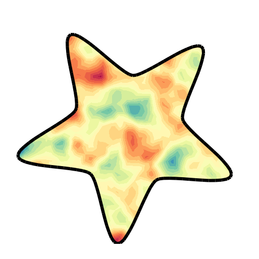
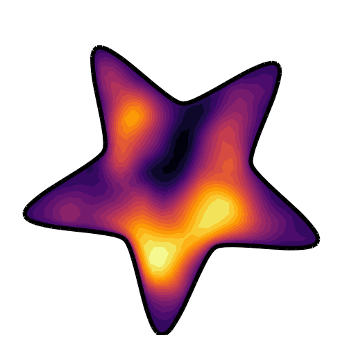

#  Tenfem

# What is Tenfem?

Tenfem is a Tensorflow + FEM (the Finite Element Method) which 
according to Wikipedia is the "The mostly widely used method for 
solving problems in engineering"
 [[citation needed]](https://en.wikipedia.org/wiki/Finite_element_method)
 . While there already exist excellent open and closed source
 FEM solving software, this library is introduced to allow a more 
 transparent integration of this software as used by engineers with
more machine learning techniques through the TensorFlow ecosystem.

This project is still in its early stages, and it primarily viewed as
a research tool. We do not intend to achieve the full power of modern
FEM solving software, but we do plan to make it much more 
straight-forward to mix machine learning components with components coming
from a FEM solver, enabling greater collaboration between classical
engineering approaches motivated by fundamental physical principles, and
the flexible, data-driven methods that have fuelled modern machine learning.
 
 ## PDEs as mechanistically inspired convolutions
 
 GP Source     | Transport Vector Field | GP Solution
:--------:|:----------------:|:-----------:
 |  | 
 
 In the when the partial differential equations (PDEs) take the form of linear
 elliptic operators we can convolve an input Gaussian process, for example a
 source field of pollutants, with a mechanistically inspired PDE which describes
 how these pollutants are spread and transported, to create an output GP which
 can encode these prior knowledge, without losing the appealing flexibility
 of the GP framework! 